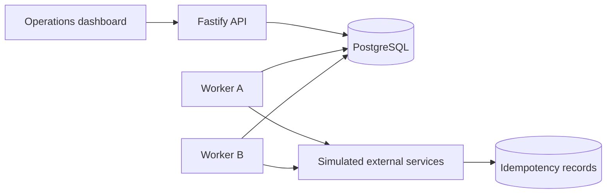
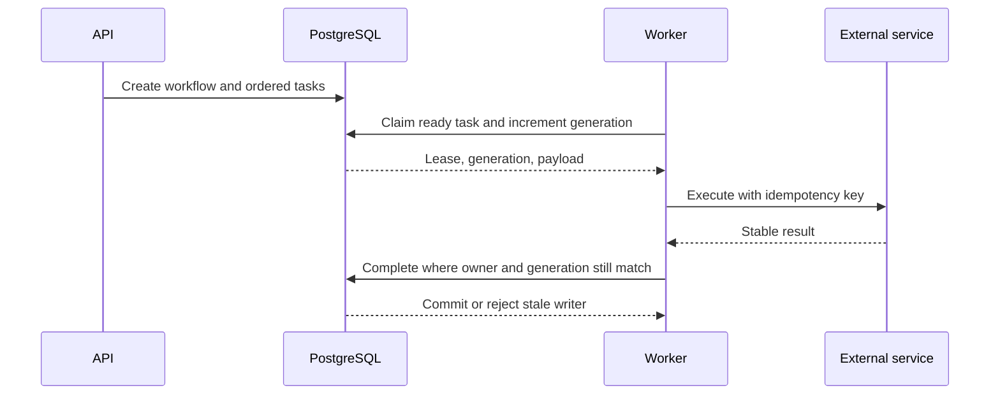

# Sentinel architecture

## Goals

Sentinel coordinates ordered workflows while preserving four properties:

1. Durable state survives process and machine failure.
2. At most one current worker generation may commit task state.
3. Retried external operations do not repeat a completed side effect.
4. A partially completed workflow has an explicit terminal or compensation path.

Sentinel provides **at-least-once task execution**. It does not claim exactly-once execution because
a database transaction cannot atomically commit an arbitrary external API call. Instead, generation
fencing protects Sentinel's database state and idempotency keys protect external effects.

## Components

### API

The API creates workflows, exposes their current state and history, and serves operator actions. It
does not execute workflow steps.

### Workers

Workers poll PostgreSQL for eligible tasks. A claim creates a time-limited lease and increments the
task generation. Every completion or failure update must match the claimed task ID, lease owner, and
generation.

### PostgreSQL

PostgreSQL is both the durable queue and the operational source of truth. Task claims and state
transitions use transactions and row-level locking. The event history is appended in the same
transaction as each operational state change.

### Dashboard

The dashboard visualizes workflows, attempts, leases, events, retries, and compensation. Phase 1
contains its application shell; operational views arrive in Phase 7.

## Source-of-truth decision

Sentinel uses mutable workflow/task projections as the operational source of truth and an immutable
event table as an audit history. It intentionally does not use full event sourcing.

This decision keeps worker claim queries and state validation straightforward while retaining enough
history to investigate crashes and demonstrate recovery. State and its corresponding event must be
written in the same PostgreSQL transaction so they cannot diverge.

## Planned execution path

## Package boundaries

- `@sentinel/config` owns environment parsing and validation.
- `@sentinel/contracts` owns shared state names and transition rules.
- `@sentinel/database` owns connections and ordered SQL migrations.
- Applications depend on packages; packages never depend on applications.

## Reliability boundaries

- A lease answers: “When may another worker try this task?”
- A generation answers: “May this worker still change Sentinel's state?”
- An idempotency key answers: “Has this external effect already happened?”
- Compensation answers: “How do we restore business consistency after permanent failure?”

These mechanisms are deliberately separate because none can replace the others.

## Phase 1 operational topology

Docker Compose starts PostgreSQL, applies migrations once, then starts the API and worker. The
dashboard starts after the API becomes healthy. Production deployment is outside Phase 1, but every
component already has an explicit process boundary and health behavior.
