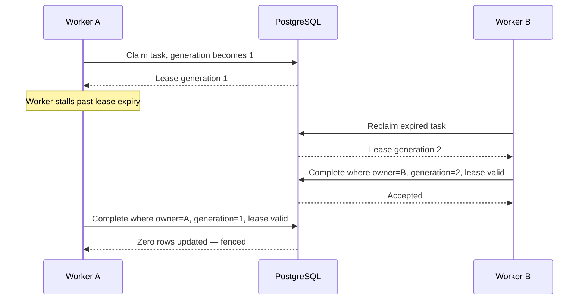

# Leasing and generation fencing

PostgreSQL is Sentinel's durable task queue. Workers coordinate only through database transactions;
no worker is trusted to decide that it still owns a task.

## Atomic claiming

A worker selects one eligible task with:

```sql
SELECT t.id
FROM tasks t
JOIN workflows w ON w.id = t.workflow_id
WHERE
  w.status IN ('pending', 'running')
  AND t.attempt_count < t.max_attempts
  AND (
    t.status = 'ready'
    OR (t.status = 'leased' AND t.lease_expires_at <= now())
  )
ORDER BY t.created_at, t.workflow_id, t.step_number
FOR UPDATE OF t SKIP LOCKED
LIMIT 1;
```

`FOR UPDATE` makes the claim exclusive, while `SKIP LOCKED` lets other workers immediately look for
different work instead of waiting behind the first worker. The claim then:

1. changes the task to `leased`;
2. records the worker identity and expiration time;
3. increments the generation and attempt count;
4. starts the workflow if this is its first claim; and
5. appends the corresponding events.

All five actions commit in one transaction.

## Lease identity

Owning a task requires the complete identity:

```text
(task_id, worker_id, generation, unexpired lease)
```

Every lease renewal, completion, and failure update includes all four predicates. A matching worker
and generation are not sufficient after the lease deadline has passed.

## Heartbeats

The worker renews its lease while the step handler is running. Sentinel requires the heartbeat
interval to be shorter than the lease duration. Defaults are:

- lease duration: 30 seconds;
- heartbeat interval: 10 seconds; and
- idle polling interval: 1 second.

If renewal returns no task—or PostgreSQL cannot confirm the renewal—the worker treats itself as
fenced and does not attempt to record success or failure.

## Stale-worker timeline



The stale completion produces no state change and no event.

## External side effects

Generation fencing protects Sentinel's PostgreSQL state. It cannot undo an external payment or
inventory call that Worker A made before stalling. Stable idempotency keys protect those downstream
effects independently.

## Concurrent execution

Each worker runs a bounded number of leases concurrently. A process claims only while an execution
slot is available, maintains a separate heartbeat for each active lease, and stops claiming
immediately during shutdown. Database pool validation reserves capacity beyond the execution slots
so claiming, heartbeats, and settlement cannot deadlock behind handlers.
