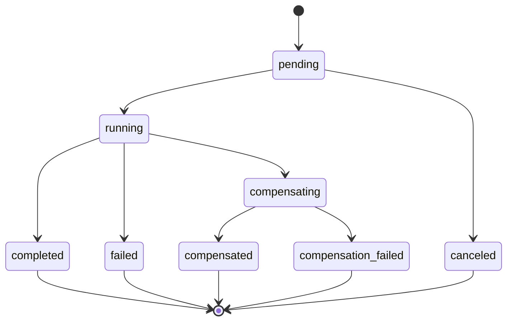
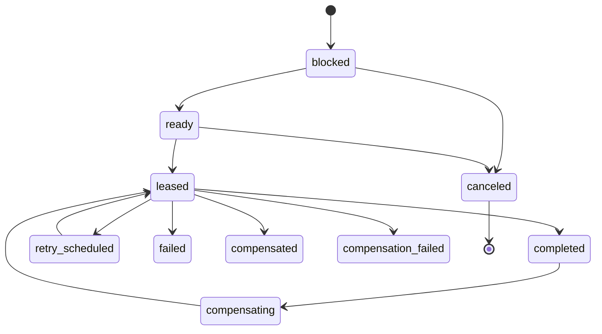

# Workflow and task state machines

The definitions in this document are implemented in `@sentinel/contracts`. Database transitions
introduced in later phases must use the same rules.

## Workflow states

| State                 | Meaning                                                                       |
| --------------------- | ----------------------------------------------------------------------------- |
| `pending`             | Definition and ordered tasks exist, but execution has not started.            |
| `running`             | At least one forward task is eligible or executing.                           |
| `compensating`        | A permanent forward failure caused reverse actions to begin.                  |
| `completed`           | Every forward task completed successfully.                                    |
| `failed`              | The workflow failed and no completed reversible action requires compensation. |
| `compensated`         | All required reverse actions completed.                                       |
| `compensation_failed` | At least one reverse action exhausted its retry policy.                       |
| `canceled`            | An operator canceled the workflow before any task started.                    |

All states except `pending`, `running`, and `compensating` are terminal for ordinary worker
execution. Explicit operator retries follow the additional guarded rules below.

## Task states

| State                 | Meaning                                                   |
| --------------------- | --------------------------------------------------------- |
| `blocked`             | A preceding workflow step has not completed.              |
| `ready`               | The task is eligible to be claimed.                       |
| `leased`              | A worker generation currently owns a time-limited lease.  |
| `retry_scheduled`     | The last attempt failed and a future retry time is set.   |
| `completed`           | The forward action completed and its result was recorded. |
| `failed`              | The forward action exhausted retries.                     |
| `compensating`        | The reverse action is eligible to be leased.              |
| `compensated`         | The reverse action completed.                             |
| `compensation_failed` | The reverse action exhausted retries.                     |
| `canceled`            | The task was canceled before workflow execution started.  |

## Transition invariants

1. A task becomes `ready` only when every preceding step is `completed`.
2. Only a ready forward task, due retry, expired lease, or activated compensation may be leased.
3. Claiming a task always increments its generation.
4. A leased-task update must match task ID, lease owner, and generation.
5. Completing a task and activating the next task occur in one transaction.
6. A terminal forward failure prevents later forward steps from becoming ready.
7. Compensation runs only for completed reversible steps, in reverse order.
8. Every accepted transition appends an event within the same transaction.

Terminal recovery transitions are not part of the ordinary worker state machine. The guarded
operator command path may move `failed → running` or `compensation_failed → compensating` only after
checking authentication, the expected workflow version, the exact terminal task shape, and an audit
reason. It adds one attempt and advances the task generation before work becomes claimable again.

## Event history

Events describe accepted changes such as `workflow.started`, `task.leased`, `task.completed`, and
`task.retry_scheduled`. They support audit and timeline reconstruction, but workers query the current
workflow/task projections rather than replaying the log during normal operation.
